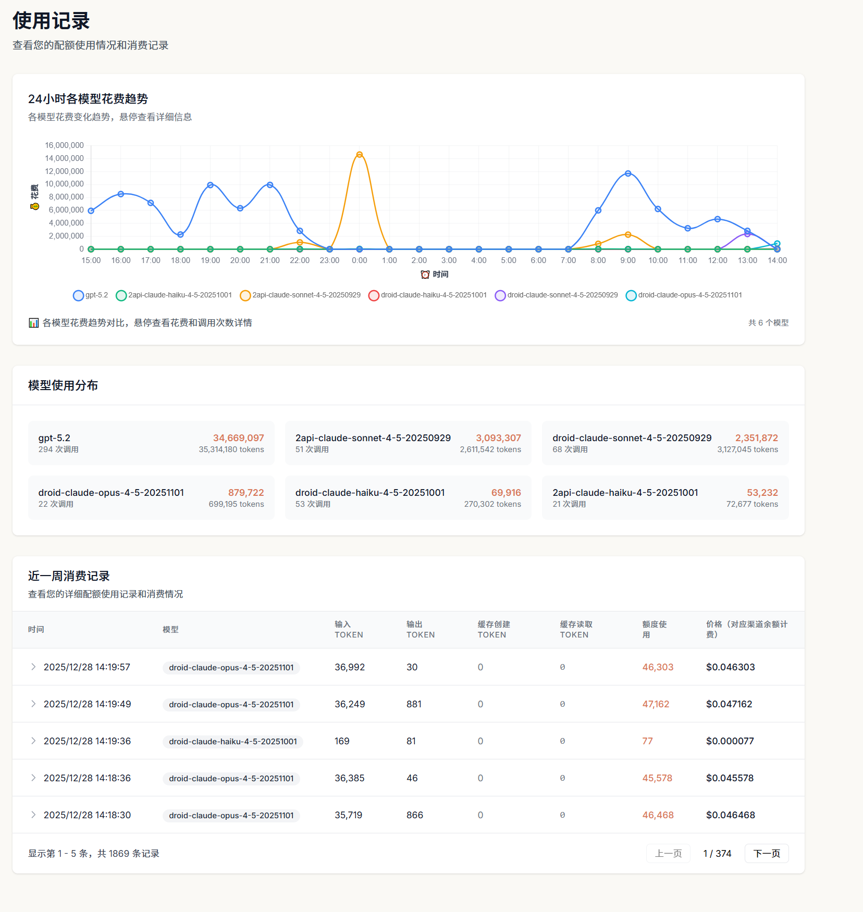

# Burn Rate Monitor 需求文档

## 1. 项目背景

Claude Code是Anthropic的CLI工具，使用过程中会产生token消耗和成本。用户需要一个可视化工具来实时监控每分钟的burn rate（消耗速率），以便更好地控制使用成本。

## 2. 项目目标

创建一个独立的Web服务，提供Claude Code使用成本的实时可视化监控。

## 2.1 参考效果图

界面风格参考上图，包含：
- 深色主题背景
- 顶部统计卡片
- 中间时间序列图表（支持鼠标悬停显示值）
- 底部视图切换按钮

## 3. 核心需求

### 3.1 功能需求

| 编号 | 需求 | 优先级 | 描述 |
|------|------|--------|------|
| F001 | 实时burn rate显示 | P0 | 显示当前每分钟的成本消耗速率 |
| F002 | 时间序列图表 | P0 | 以图表形式展示burn rate随时间的变化 |
| F003 | 鼠标悬停显示值 | P0 | 鼠标移动到图表坐标点时显示具体数值 |
| F004 | 多视图支持 | P1 | 支持当前块、今日、24小时等多种视图 |
| F005 | 统计卡片 | P1 | 顶部显示关键统计数据 |
| F006 | Upstream来源区分 | P1 | 按模型+upstream组合分别显示数据 |
| F007 | 折扣前成本对比 | P1 | 显示折扣前原价与实际成本的对比 |
| F008 | Tokens/费用视图切换 | P1 | 支持在tokens数量和USD费用之间切换显示 |
| F009 | 历史价格持久化 | P1 | 保存模型定价和渠道倍率历史，确保历史成本计算准确 |

### 3.2 非功能需求

| 编号 | 需求 | 描述 |
|------|------|------|
| NF001 | 独立性 | 与ccusage完全独立，不受ccusage更新影响 |
| NF002 | 端口 | 不使用8000端口 |
| NF003 | 安装方式 | 支持pip install -e .开发安装 |
| NF004 | 界面风格 | 深色主题，类似ccusage文档截图风格 |

## 4. 数据来源

直接读取Claude Code的JSONL文件：
- Windows: `~/.claude/projects/` 或 `~/.config/claude/projects/`
- Linux/macOS: `~/.claude/projects/` 或 `~/.config/claude/projects/`

JSONL文件已包含`costUSD`字段，无需依赖外部定价数据。

## 5. 用户场景

### 场景1：实时监控
用户启动brmonitor服务，打开浏览器查看当前的burn rate，了解Claude Code的实时消耗情况。

### 场景2：历史分析
用户切换到"今日"或"24小时"视图，分析一段时间内的消耗趋势。

### 场景3：成本预警
用户通过图表观察burn rate的变化趋势，及时发现异常高消耗。

## 6. 验收标准

1. 服务启动后可通过浏览器访问
2. 图表正确显示burn rate时间序列
3. 鼠标悬停可显示具体时间和成本值
4. 支持pip install -e .安装
5. 界面为深色主题
